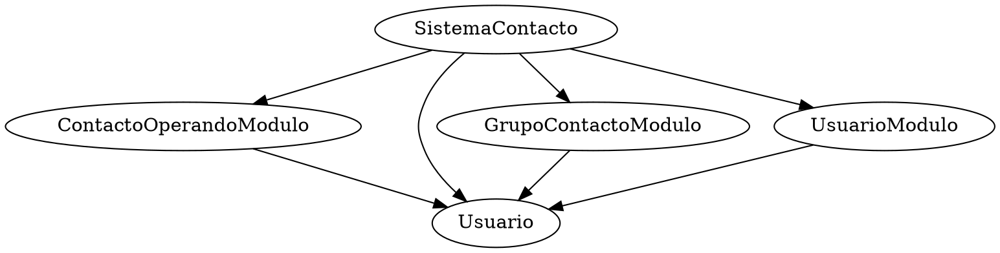

# Ejercicio 1

## Analisis de acoplamiento

Antes de comenzar revisemos cada clase que tenemos, y representaremos mediante un `grafo` que dependencias tiene cada modulo.
De momento tenemos(para el calculo de acoplamiento aferente):

```java
ContactoOperacionesModulo = {}
GrupoContactoModulo = {}
SistemaContactos = {}
Usuario = {}
UsuarioModulo = {}
```

Despues de revisar las interdependencias entre modulos obtenemos los siguiente



### Analisis del grafico

1. `ContactoOperacionesModulo.java`
   - Contiene la funcion `enviarMensaje(String mensaje, Usuario usuario)`  que requiere de la clase `Usuario`.
   - Clase `ContactoOperacionesModulo` utiliza variables de `Usuario`.
   - Entonces su acoplamiento eferente **(Ce)** es 1.
   - **Ca** = 1
   - Y agregamos `ContactoOperacionesModulo` a `Usuario` como su acoplamiento aferente **(Ca)**
   - `Usuario` = {ContactoOperacionesModulo}
2. `GrupoContactoModulo`
   - Tiene la variable `static Map<String, List<Usuario>> grupos` que requiere de la clase `Usuario`.
   - Tiene la funcion `agregarUsuarioAGrupo(Usuario usuario, String grupoNombre)` que requiere de la clase `Usuario`
   - Clase `GrupoContactoModulo` utiliza variables de `Usuario`
   - Entonces su **Ce** es 1.
   - **Ca** = 1
   - Agregamos `GrupoContactoModulo` a `Usuario` como **Ca**
   - `Usuario` = {ContactoOperacionesModulo,GrupoContactoModulo}
3. `SistemaContacto`
   - Clase principal(contiene la funcion *main*)
   - `SistemaContacto` utiliza `UsuarioModulo, Usuario, ContactoOperacionesModulo y GrupoContactoModulo`.
   - Por lo tanto su **Ce** es 4
   - Al ser la funcion principal, su **Ca** es de 0
   - `UsuarioModulo` = {SistemaContacto}
   - `Usuario` = {ContactoOperacionesModulo,GrupoContactoModulo,SistemaContacto}
   - `ContactoOperacionesModulo` = {SistemaContacto}
   - `GrupoContactoModulo` = {SistemaContacto}
4. `UsuarioModulo`
   - `UsuarioContacto` utiliza `Usuario`
   - Su **Ce** es 1
   - Su **Ca** es 1
5. `Usuario`
   - Es una clase que no requiere de otros modulos para su funcionamiento
   - Su **Ce** es 0
   - Su **Ca** es 4

## Resultados de acoplamiento

### Factor de acoplamiento

**CF** = e / a * (n - 1)
**CF** = (1 + 1 + 1 + 1 + 4 + 0 + 1 + 1 + 0 + 4) / 5 * (5 - 1)
**CF** = 11.2

### Inestabilidad

**I=(Ce/(Ca+ Ce))**

