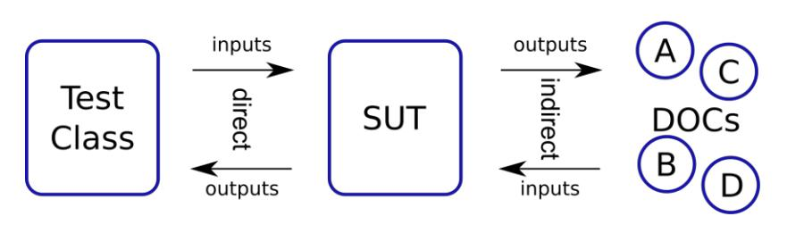

# Primera Prueba con JUnit 5

## Objetivo de la actividad

El objetivo de esta actividad es familiarizarse con el uso de JUnit 5 y AssertJ para crear pruebas unitarias
en el desarrollo de software. Se espera que los participantes comprendan cómo escribir pruebas unitarias efectivas para garantizar la calidad del código y mejorar la robustez de sus aplicaciones.

## Prerequisitos 🤔

Utiliza el código entregado en el repositorio de apoyo del curso [Link](https://github.com/kapumota/Actividades-CC3S2/tree/main)

## Entregable

Presenta las respuestas y el codigo solicitado en tu repositorio personal de Github del curso.

## Conceptos importantes

🔷 `SUT(sistema bajo prueba)` : entendemos la parte del sistema que se está probando.
Dependiendo del tipo de prueba, el SUT puede tener granularidades muy diferentes, desde una
sola clase hasta toda una aplicación.

🔷 `DOC(Depended On Component)` : es cualquier entidad que sea necesaria para que un SUT
cumpla con sus funciones.
Por lo general, un DOC tiene la misma granularidad que el SUT, por ejemplo, si el SUT es una clase, entonces usa otras clases; si es un módulo, entonces colabora con otros módulos.

DOC y colaboradores son lo mismo en esta clase.

🔷 `Prueba Unitaria (Unit Testing)`: Es un tipo de prueba que se enfoca en probar unidades
individuales de código, como métodos o funciones, de manera aislada del resto del sistema.
Utilizaremos este gráfico en la explicación de la actividad.

🔷 `Framework de Pruebas JUnit 5`: JUnit 5 es un framework de pruebas para Java que proporciona
anotaciones y APIs para escribir y ejecutar pruebas unitarias.

🔷 `AssertJ`: AssertJ es una biblioteca de aserciones en Java que proporciona métodos más
expresivos y legibles para realizar afirmaciones en las pruebas unitarias.

## Preguntas

1. Explica el siguiente gráfico en términos de SUT y DOC para pruebas unitarias



- Solucion:
  
    :point_right: El `SUT` recibe un input de `DOC` porque este brinda herramientas para que el `SUT` realice sus funciones sobre `Test Class`, y el `SUT` genera un output que se aplica a un `Test Class` en este caso, luego el `Test Class` arroja un resultado que es esperado por el `SUT`, y a su vez, por el `DOC`.

2. Imaginemos algún servicio financiero (clase FinancialService) que, en función del último pago del cliente y su tipo (cualquiera que sea), calcula algún "bonus".
   
```java
public class FinancialService {
.... // definition of fields and other methods omitted
    public BigDecimal calculateBonus(long clientId, BigDecimal payment) {
        Short clientType = clientDAO.getClientType(clientId);
        BigDecimal bonus = calculator.calculateBonus(clientType, payment);
        clientDAO.saveBonusHistory(clientId, bonus);
        return bonus;
    }
}
```

Identifica el SUT y sus colaboradores (DOC) y describe los tipos de interacción que ocurren dentro del método  `calculateBonus()` importantes para la prueba.

- Solucion:

    `SUT` : El metodo `calculateBonus()` contenido en la clase `FinancialService`.

    `DOC(s)` : Podemos ver que el metodo `calculateBonus` requiere de `clientDAO` y `calculator`,es decir, ambas clases brindan          herramientas a `calculateBonus()` realice funciones sobre `FinancialService`.

    `Interacciones` en `calculateBonus` : vemos que se invoca a `clientDAO.getClientType(clientID)` para obtener el tipo de cliente y a `calculator.calculateBonus(clientType,payment)` para calcular `bonus` segun el monto y el tipo de cliente.
Por ultimo, vemos que se invoca a `clientDAO.savebonusHistory(clientID,bonus)` para guardar el bonus.

3. Sea la abstraccion siguiente:
   
¿Como crees que serían las pruebas de los trabajos y la de los gerentes? ¿Por qué preocuparse por las interacciones indirectas?

- Solucion

    Las pruebas de trabajo y gerentes deben verificar si cada clase se comporta o actua como se espera.

    Las interacciones indirectas son importantes, si bien una clase puede funcionar de forma aislada, puede generar inconventientes al         momento de interactuar con otras clases.

4. Completa en la actividad dada en el repositorio el código fuente para pasar las pruebas.
Actividad completada, ver en [Actividad JUnit5](https://github.com/GaboYR/CC3S2/tree/main/Actividad-PrimeraPruebaJUnit5).

5. ¿Cuál es la diferencia entre una prueba unitaria y otros tipos de pruebas, como las pruebas de
integración o las pruebas de aceptación?

Algo que tienen en comun estas pruebas es que todas esperan cumplir con lo esperado por las partes interesadas.
Algunas comparaciones:
- Prueba unitaria: se enfocan en partes del codigo de forma aislada.
- Prueba de integracion: se enfocan en un correcto funcionamiento entre diferentes modulos del sistema.
- Pruebas de aceptacion : se enfoca en la funcionalidad completa del software, es la parte final.

Podemos decir que el desarrollo de estas pruebas se dan en el orden: 

> Prueba unitaria :arrow_right: Prueba de integracion :arrow_right: Prueba de aceptacion
