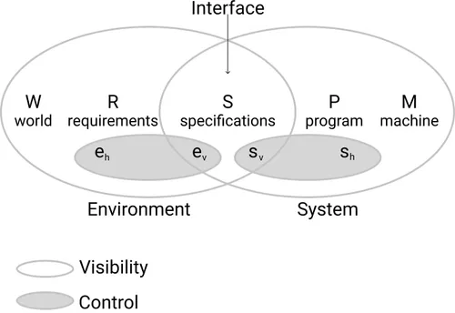

# Semana 1
## Dia lunes
### Conceptos previos:
*Requerimiento* : condicion o capacidad que debe estar presente en un software.
Sirven como pilares funcdamentales donde se dise;an software.Se dividen en:
### Requerimientos funcionales(FR):
Es una descripción de las funciones que un sistema o software debe realizar. Define lo que el sistema deberá hacer y cómo debe responder a las entradas y acciones del usuario.
En otras palabras, los requisitos funcionales establecen qué debe hacer el sistema, sin especificar cómo se implementará.
Acciones específicas que el sistema debe ser capaz de realizar.
### Requirimientos no funcionales(NFR): 
Definen los atributos de calidad del sistema, como la seguridad, la usabilidad, el rendimiento y la compatibilidad. En palabras más sencillas, no hablan de “lo que” hace el sistema, sino de “cómo” lo hace. Alternativamente, definen restricciones del sistema tales como la capacidad de los dispositivos de entrada/salida y la representación de los datos utilizados en la interfaz del sistema.

## *Ejemplo : Requerimientos Funcionales para un Software de Reparto de Comida por Delivery.*

**1. Funcionalidades Básicas:**

`Registro de usuarios:` Permitir a los usuarios registrarse en el sistema creando una cuenta con su información personal, dirección de entrega y preferencias.

`Búsqueda de restaurantes:` Permitir a los usuarios buscar restaurantes por nombre, ubicación, tipo de cocina, precio, etc.

`Visualización de menús:` Mostrar los menús de los restaurantes con información sobre los platos, precios, ingredientes y disponibilidad.

`Realización de pedidos:` Permitir a los usuarios realizar pedidos de comida seleccionando platos del menú, indicando la cantidad y las preferencias de entrega.

`Seguimiento del pedido:` Permitir a los usuarios seguir el estado de su pedido en tiempo real, desde la preparación hasta la entrega.

`Pago del pedido:` Ofrecer diferentes opciones de pago online y contra reembolso.

`Historial de pedidos:` Mostrar un historial con los pedidos realizados por el usuario, incluyendo información sobre la fecha, el restaurante, los platos y el precio.

**2. Funcionalidades Avanzadas:**

`Sistema de recomendaciones:` Recomendar restaurantes y platos al usuario en base a sus preferencias y su historial de pedidos.

`Programa de fidelización:` Ofrecer descuentos y promociones a los usuarios que más utilizan el servicio.

`Valoración de restaurantes y platos:` Permitir a los usuarios valorar los restaurantes y los platos que han probado.

`Chat en vivo:` Ofrecer un chat en vivo para que los usuarios puedan comunicarse con el servicio de atención al cliente.

`Integración con redes sociales:` Permitir a los usuarios iniciar sesión en el sistema con sus cuentas de redes sociales.

## *Requerimientos No Funcionales para un Software de Reparto de Comida por Delivery*

`1. Rendimiento:`

El sistema debe ser capaz de gestionar un alto volumen de pedidos sin que se produzcan errores o retrasos.
El tiempo de carga de las páginas debe ser rápido y fluido.

`2. Seguridad:`

El sistema debe proteger la información personal y financiera de los usuarios.
Los datos de los pedidos deben ser encriptados para evitar su robo o manipulación.

`3. Usabilidad:`

El sistema debe ser fácil de usar e intuitivo para usuarios de cualquier nivel de experiencia tecnológica.
La interfaz del usuario debe ser clara y organizada.

`4. Escalabilidad:`

El sistema debe ser capaz de adaptarse a un aumento en el número de usuarios y pedidos.
Se debe poder agregar nuevas funcionalidades al sistema sin afectar su rendimiento.

`5. Mantenibilidad:`

El código del sistema debe ser fácil de entender y mantener.
Se deben realizar pruebas de calidad para asegurar el correcto funcionamiento del sistema.

`6. Disponibilidad:`

El sistema debe estar disponible 24/7 para que los usuarios puedan realizar pedidos en cualquier momento.
Se debe contar con un plan de contingencia para evitar interrupciones en el servicio.

`7. Compatibilidad:`

El sistema debe ser compatible con diferentes dispositivos y navegadores web.

# -----------------------------------------------------------------------------------------------
**WRSPM** : 

  

`WRSPM` Ayuda a comprender y modelar el sistema que estamos desarrollamdo.
Enfatiza que para crear sol efectiva se debe considerar el entorno.
`mapping` traduccion de los inputs al output de la maquina
## ¿Puedes identificar los componentes del WRSP en un ATM ?
`world` 
`maquina` 
`estimulo`
`fenomeno`

## ¿Puedes identificar los componentes del WRSP en el desarrollo de una aplicación móvil de navegación para conductores. ?

# Parte 2
La arquitectura es la organización fundamental de un sistema de software
incorporada en sus componentes, sus relaciones entre sí y con el entorno
y los principios que guían su diseño y evolución.
Es un proceso y producto, representacion de alto nivel.
Puente entre el codigo y los requisitos.
## Proceso de arquitectura de software
1. Análisis de requisitos
2. Estructura del sistema
3. Selección de patrones arquitectónicos
4. Definición de los componentes
5. Evaluación y validación
